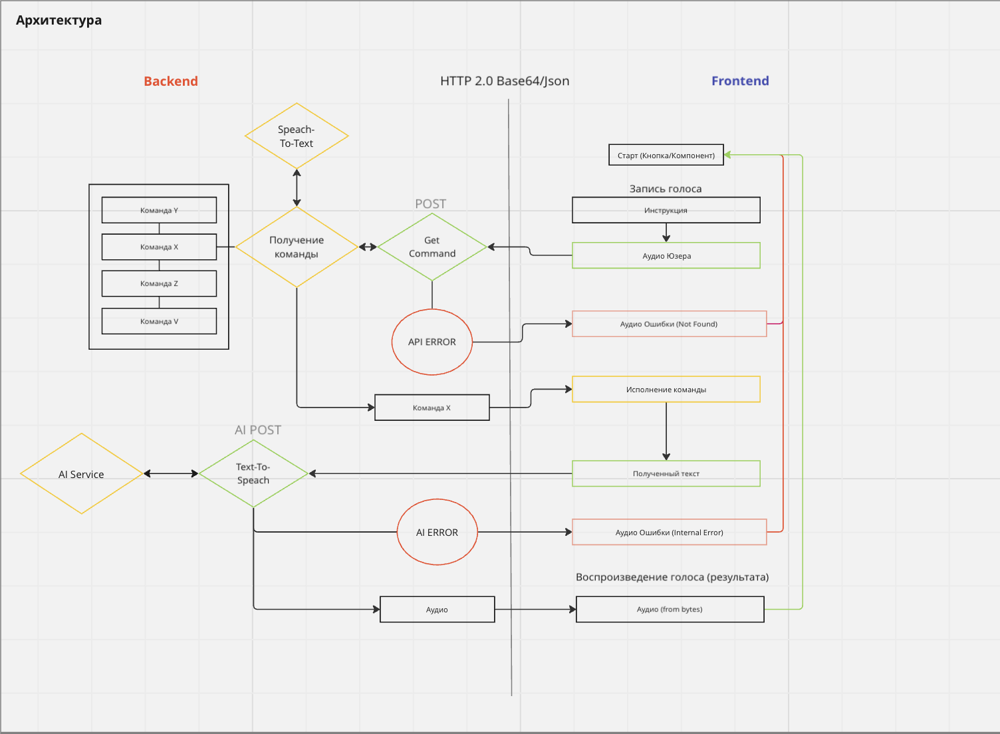
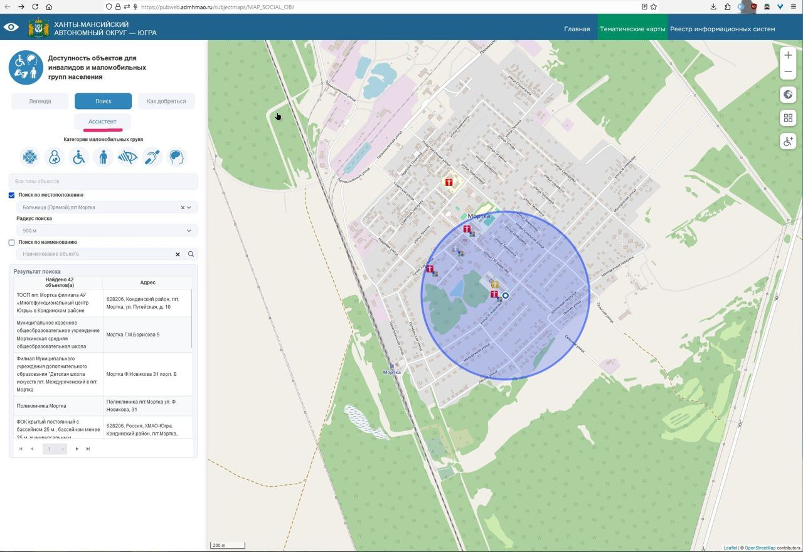

  

<h1>Голосовой ассистент</h1>

Голосовой ассистент для людей маломобильной группы населения, с возможностью классификации команд засчет обученной NLP-модели.

<b>Специально для хакатона <a href="https://хантатон.рф/2024/"><i>-Югорский Хантатон 2024-</i></a></b>

***

## Над проектом работали
- Павленко Ольга Павловна (дизайнер)
- Агишев Рафаэль Ринатович (Fullstack - разработчик)
- Голощапов Максим Сергеевич (Fullstack - разработчик)

## Запуск и Технологии

Для установки, тестирования и запуска: **[installation.md](docs/installation.md)**

Основные технологии:
- Python3.12
- FastAPI
- Utils
    - Poetry
    - Loguru
    - Pydantic
- Libs
    - gTTS
    - faster-whisper
    - transformers
    - torch
- AI
    - Whisper (speech2text)
    - Custom classifier
    - Google Text2Speech

Вся логика frontend части описана в **[index.js](src/component/js/index.js)**

## Обучение NLP Модели

Посмотреть процесс обучения локальной модели можно в **[train.md](docs/train.md)**

## Архитектура проекта

> Бэкенд, занимается обработкой полученного с фронта голоса
> - сначала переводит его в текст (Whisper)
> - потом определяют заложенную в нем команду с помощью специально обученной нейросети ([train.md](docs/train.md))
> - затем полученный текст от фронтенда переводит в аудио (gTTS)

> Фронтенд, занимается записью голоса и отправкой его на бэк, после получения команды, исполняет ее и озвучивает аудио.

## Использование голосового ассистента 
Голосовой ассистента доступен в разделе "Тематическая карта", для его использования необходимо нажать на кнопку "ассистент"

## Кейс

_[Все Кейсы](https://hackathon.uriit.ru/2024/tasks/)_

11 кейс - "Голосовой ассистент для карты «Доступность объектов для инвалидов и маломобильных групп населения» ТИС Югры"

