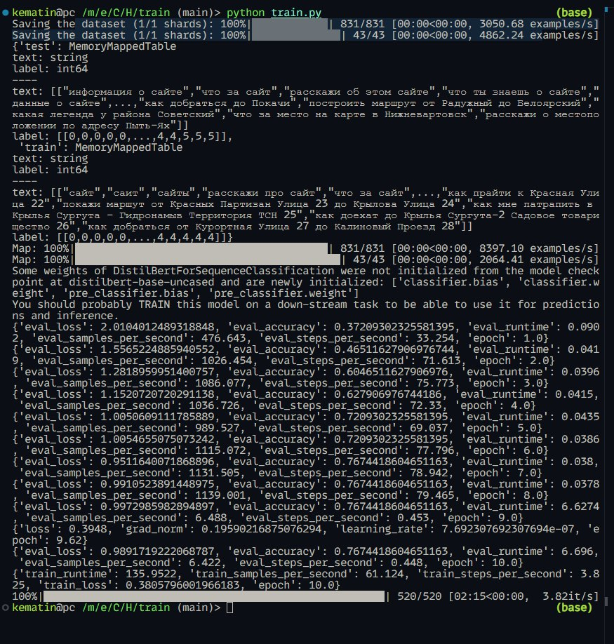
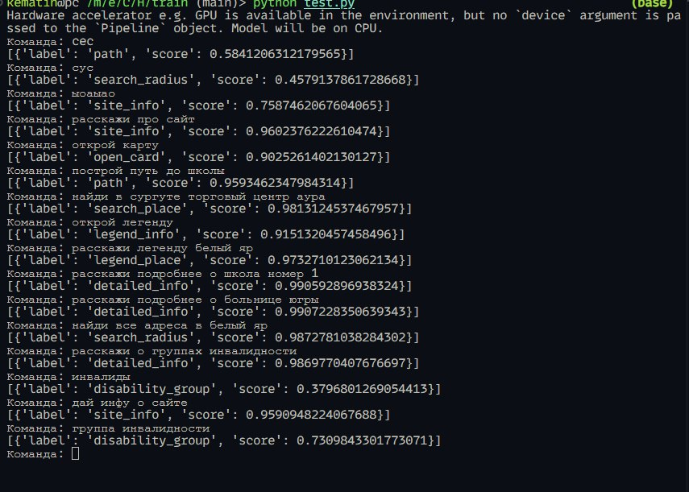

# Обучение модели для классификации текста

## Подготовка датасета

С начало были определены все команды, доступные для обработки голосового ассистента:

```
labels:
- site_info
- legend_info
- open_card
- disability_group
- legend_place
- search_radius
- detailed_info
- search_place
```

Далее шла подготовка основого и тестового датасета на +- 1000 записей: **[dataset.csv](../train/dataset.csv)**

Пример датасета:
```python
# Карта
open_card_dataset = [
    {"text": "покажи карту", "label": "open_card"},
    {"text": "открой карту", "label": "open_card"},
    {"text": "карта", "label": "open_card"},
    {"text": "хочу увидеть карту", "label": "open_card"},
    {"text": "покажи местность на карте", "label": "open_card"},
    {"text": "где карта", "label": "open_card"},
    ...
]
```

После чего этот датасет был скачен в нужный формат и подгружен для дальнейшей тренировки:

```python
id2label = {
    0: "site_info",
    1: "legend_info",
    2: "open_card",
    3: "disability_group",
    4: "path",
    5: "legend_place",
    6: "search_radius",
    7: "detailed_info",
    8: "search_place",
}

label2id = {
    "site_info": 0,
    "legend_info": 1,
    "open_card": 2,
    "disability_group": 3,
    "path": 4,
    "legend_place": 5,
    "search_radius": 6,
    "detailed_info": 7,
    "search_place": 8,
}

num_labels = 9

datasetname = "main_dataset"

def get_dataset_from_csv(filename):
    dataset = []

    with open(filename, newline="", encoding="utf-8") as csvfile:
        reader = csv.DictReader(csvfile)
        for row in reader:
            dataset.append(row)

    return dataset

def create_dataset(dataset):
    train_texts = [data["text"] for data in dataset]
    train_labels = [label2id[data["label"]] for data in dataset]

    test_texts = [data["text"] for data in test_dataset_info]
    test_labels = [label2id[data["label"]] for data in test_dataset_info]

    train_dataset = Dataset.from_dict({"text": train_texts, "label": train_labels})
    test_dataset = Dataset.from_dict({"text": test_texts, "label": test_labels})

    dataset_dict = DatasetDict({"train": train_dataset, "test": test_dataset})
    dataset_dict.save_to_disk(datasetname)

    return datasetname


def read_dataset(datasetname: str):
    loaded_dataset = DatasetDict().load_from_disk(datasetname)
    return loaded_dataset

dataset_info = get_dataset_from_csv("dataset.csv")
create_dataset(dataset_info)
dataset = read_dataset(datasetname)
```

## Обучение модели

Hugging Face предоставляет удобный инструментарий для создания, обучения и использования NLP моделей, так что мы использовали библиотеку **transformers** и подгружали натренированный токенайзер модели **distilbert-base-uncased** для обучения модели.

Обучения производилось по методу эпох, всего их было 10, лучшей по итогам оказалась 7 эпоха с цифрами:
- eval_loss: 0.95
- eval_accuracy: 0.767 (~77%)



```python

def preprocess_function(examples):
    return tokenizer(examples["text"], padding=True, truncation=True)


def compute_metrics(eval_pred):
    predictions, labels = eval_pred
    preds = np.argmax(predictions, axis=1)
    accuracy = (preds == labels).mean()
    return {"accuracy": accuracy}


def train(model_name):
    loaded_dataset = read_dataset(datasetname)

    tokenized_new_dataset_dict = loaded_dataset.map(
        preprocess_function,
        batched=True,
    )
    data_collator = DataCollatorWithPadding(tokenizer=tokenizer)

    model = AutoModelForSequenceClassification.from_pretrained(
        "distilbert-base-uncased",
        num_labels=num_labels,
        id2label=id2label,
        label2id=label2id,
    )

    training_args = TrainingArguments(
        output_dir=model_name,
        learning_rate=2e-5,
        per_device_train_batch_size=16,
        per_device_eval_batch_size=16,
        num_train_epochs=10,
        weight_decay=0.01,
        eval_strategy="epoch",
        save_strategy="epoch",
        load_best_model_at_end=True,
    )

    trainer = Trainer(
        model=model,
        args=training_args,
        train_dataset=tokenized_new_dataset_dict["train"],
        eval_dataset=tokenized_new_dataset_dict["test"],
        processing_class=tokenizer,
        data_collator=data_collator,
        compute_metrics=compute_metrics,
    )

    trainer.train()
```

## Тестирование

Для тестирования модели был написан небольшой скрипт, который по результатам работы угадывал команды с примерным шансом 90%

- score: 0.9-0.99 (~90-99%)



```python
from transformers import pipeline

model = "hmao_model/checkpoint-364"

classifier = pipeline("text-classification", model)

while True:
    text = input("Команда: ")
    print(classifier(text))

```

### Все !